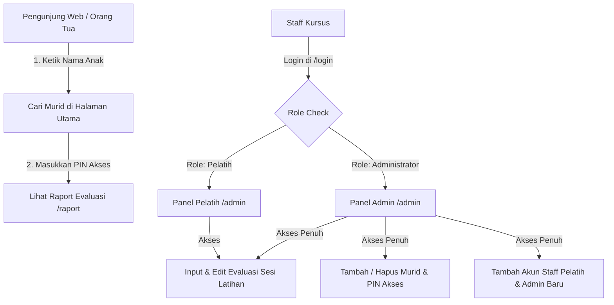

# 🏊‍♂️ AYO RENANG - Dokumentasi Perbaikan & Arsitektur Sistem

## 📋 Ringkasan Perjalanan Proyek

Dokumen ini berisi catatan komprehensif mengenai kendala awal, perbaikan sistem, arsitektur hak akses baru, hingga integrasi Custom Domain **`ayorenang.my.id`** untuk aplikasi **AYO RENANG** (Sistem Catatan Perkembangan & Evaluasi Peserta Les Berenang).

---

## 🛠️ 1. Masalah Awal & Solusi Perbaikan

| No | Masalah Paling Awal | Penyebab Utama | Solusi Perbaikan | Status |
| :---: | :--- | :--- | :--- | :---: |
| **1** | **Error 429 (Rate Limit Supabase)** saat pendaftaran akun baru. | Fitur *Confirm Email* bawaan Supabase aktif, menahan pendaftaran berturut-turut. | Menonaktifkan *Confirm Email* di Dashboard Supabase (Authentication -> Providers -> Email). | ✅ Selesai |
| **2** | **"Permission Denied for Table Students"** saat membuka dashboard. | Schema PostgreSQL belum diberikan izin `GRANT` untuk role `anon` dan `authenticated`. | Memperbarui `setup.sql` dengan `GRANT ALL ON ALL TABLES IN SCHEMA public TO anon, authenticated;`. | ✅ Selesai |
| **3** | **"Akun berhasil masuk, tapi profil belum terdaftar"** & Crash UUID `parent_id`. | Trigger profil belum jalan dan input UUID `parent_id` berisi string kosong `""`. | Menambahkan fungsi *Self-Healing Profile* di `auth.js` dan mengubah `parent_id` kosong menjadi `null`. | ✅ Selesai |
| **4** | **Alur Orang Tua Rumit** (*"Belum Ada Peserta Terhubung"*). | Orang tua diwajibkan membuat akun & melakukan sinkronisasi email rumit. | Mengubah alur: Orang tua **tanpa perlu login/daftar**, cukup cari nama anak & masukkan **PIN 4-Digit**. | ✅ Selesai |
| **5** | **Pop-Up Browser Kaku (`prompt()`)** saat input PIN Wali. | Menggunakan fungsi bawaan `prompt()` browser yang kurang rapi di mobile. | Mengganti dengan **Custom In-Page Glassmorphic Modal UI** di tengah halaman web. | ✅ Selesai |
| **6** | **URL Menggunakan `.html`**. | Struktur file HTML tunggal di root. | Merestrukturisasi halaman ke sub-folder (`login/index.html`, `admin/index.html`, dll) untuk mendukung **Clean URLs**. | ✅ Selesai |

---

## 🏗️ 2. Arsitektur Hak Akses & Peran Pengguna (Role System)

Sistem dirancang dengan pemisahan peran yang tegas untuk keamanan dan kemudahan penggunaan:



### 👤 Detail Role:
1. **Orang Tua / Wali Murid (Tanpa Account / Public)**
   - Akses halaman utama `https://ayorenang.my.id/`.
   - Menginputkan nama anak di kolom pencarian.
   - Menginputkan **PIN Akses 4-digit** untuk membuka halaman raport.
2. **Pelatih (Coach)**
   - Login via `https://ayorenang.my.id/login`.
   - Mengisi materi latihan, hasil evaluasi (*Belum Bisa, Mulai Berkembang, Berkembang, Sangat Baik*), dan catatan detail perkembangan murid.
3. **Administrator (Admin)**
   - Memiliki seluruh hak akses Pelatih.
   - Pendaftaran peserta baru (nama, usia, foto, & PIN akses wali).
   - Pembuatan akun staff baru (*Pelatih* atau *Admin*).
   - Penghapusan data peserta.

---

## 🌐 3. Daftar Clean URL Resmi (`ayorenang.my.id`)

| Nama Halaman | Fungsi Utama | Clean URL Resmi |
| :--- | :--- | :--- |
| **🏠 Halaman Utama & Pencarian** | Pencarian nama anak bagi Orang Tua | [`https://ayorenang.my.id/`](https://ayorenang.my.id/) |
| **🔑 Portal Masuk Staff** | Login khusus Pelatih & Administrator | [`https://ayorenang.my.id/login`](https://ayorenang.my.id/login) |
| **📝 Registrasi Staff Baru** | Pendaftaran akun Pelatih / Admin baru | [`https://ayorenang.my.id/register`](https://ayorenang.my.id/register) |
| **🖥️ Panel Pengelola Staff** | Dashboard Input Evaluasi & Data Murid | [`https://ayorenang.my.id/admin`](https://ayorenang.my.id/admin) |
| **📋 Halaman Raport Murid** | Lembar riwayat evaluasi latihan anak | [`https://ayorenang.my.id/raport`](https://ayorenang.my.id/raport) |

---

## ⚙️ 4. Pengaturan DNS Custom Domain (`ayorenang.my.id`)

File [`CNAME`](file:///C:/Users/jefry/.gemini/antigravity/scratch/Raport-Ayo-Renang/CNAME) telah dibuat di repositori. Berikut adalah pengkonfigurasian DNS Record pada penyedia domain:

### A Record (Domain Utama `@` / `ayorenang.my.id`)
- **Type**: `A` | **Host**: `@` | **Target IP**: `185.199.108.153`
- **Type**: `A` | **Host**: `@` | **Target IP**: `185.199.109.153`
- **Type**: `A` | **Host**: `@` | **Target IP**: `185.199.110.153`
- **Type**: `A` | **Host**: `@` | **Target IP**: `185.199.111.153`

### CNAME Record (Subdomain `www`)
- **Type**: `CNAME` | **Host**: `www` | **Target**: `sofiyahauliah24-lab.github.io`

---

## 💾 5. Struktur Repositori Terkini

```
Raport-Ayo-Renang/
├── CNAME                    # Domain config: ayorenang.my.id
├── BLUEPRINT.md             # Dokumentasi proyek & perbaikan ini
├── setup.sql                # Schema & RLS policies Supabase
├── index.html               # Halaman utama & pencarian publik
├── css/
│   └── style.css            # Styling visual & modal overlay
├── js/
│   ├── supabaseClient.js    # Inisialisasi Supabase client
│   ├── auth.js              # Helpers autentikasi & session
│   ├── login.js             # Logic login staff
│   ├── register.js          # Logic pendaftaran staff
│   ├── admin.js             # Logic dashboard pelatih & admin
│   └── raport.js            # Logic render timeline & verifikasi PIN
├── login/
│   └── index.html           # Clean URL /login
├── register/
│   └── index.html           # Clean URL /register
├── admin/
│   └── index.html           # Clean URL /admin
└── raport/
    └── index.html           # Clean URL /raport
```

---
*Dokumen ini dibuat otomatis oleh Antigravity AI Agent — 2026.*
